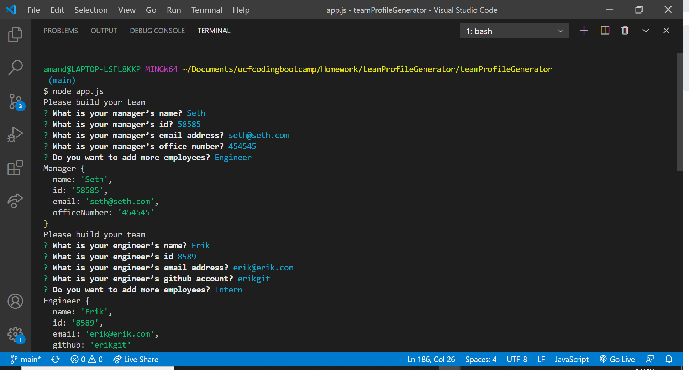
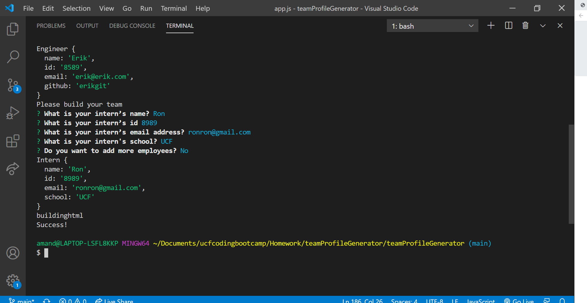
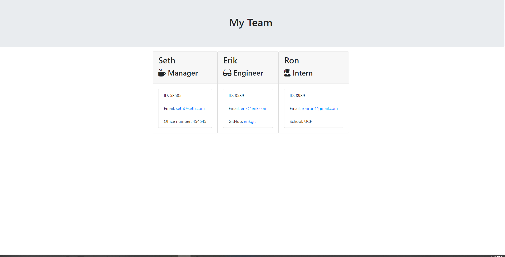

# Team Profile Generator 

## Description
This is a node.js application to generate a team profile.  While running the app the user will be prompted to answer questions starting with manager. Then will be given the choice to add intern and/or engineer. Validator have been added to insure correct information is entered for emails and Id numbers.

*https://amandaln.github.io/teamProfileGenerator/

## Technologies
HTML

CSS/Bootstrap

JavaScript

JSON

Node.js

## Usage

## Maintainer
Amanda Nelson

## License
[MIT](https://choosealicense.com/licenses/mit/)